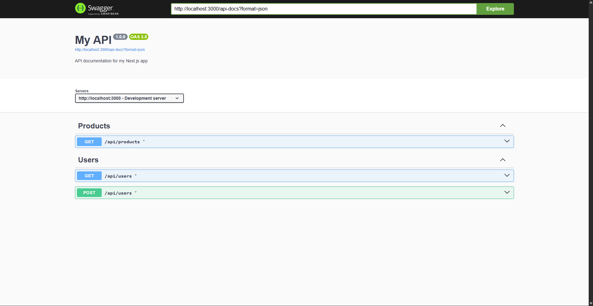

# nextjs-auto-swagger

**Automatic Swagger UI generation for Next.js 15+ App Router API routes**

Easily generate and serve a Swagger UI for your API endpoints in **Next.js App Router**, just like in FastAPI. This package parses JSDoc-style comments in your API handlers to automatically generate OpenAPI 3.0 documentation.

---

## Features

- Automatic Swagger UI at `/api-docs`
- Smart parsing of JSDoc-style comments like `@tag`, `@summary`, etc.
- Grouping and naming endpoints like FastAPI
- Zero config — works out of the box with minimal setup
- Works with any API route in the `app/api/` folder

---

# Installation

```bash
npm install nextjs-auto-swagger

or

pnpm add nextjs-auto-swagger

or

yarn add nextjs-auto-swagger
```

# Usage
Create a Swagger route
Create the file: app/api-docs/route.ts

```bash
import { createSwaggerHandler } from 'nextjs-auto-swagger';

const handler = createSwaggerHandler({
  title: 'My API',
  version: '1.0.0',
  description: 'API documentation for my Next.js app',
  servers: [
    {
      url: 'http://localhost:3000',
      description: 'Development server'
    }
  ]
});

export const GET = handler.GET;
```

# Document your API endpoints
Add JSDoc-style comments in your API route handlers to auto-generate docs.
Example: app/api/users/route.ts

```bash
import { NextResponse } from 'next/server';

const dummyUsers = [{ id: 1, name: 'John' }];

/**
 * Get all users
 * @tag Users
 * @summary List all users
 */
export async function GET() {
  return NextResponse.json(dummyUsers);
}

/**
 * Create a new user
 * @tag Users
 * @summary Create user
 */
export async function POST() {
  return NextResponse.json({ message: 'User created' }, { status: 201 });
}
```

## Supported JSDoc Tags

| Tag           | Description                             |
|---------------|-----------------------------------------|
| `@tag`        | Group endpoints by name (like FastAPI)  |
| `@summary`    | Short description for the endpoint      |
| `@description`| Longer detailed explanation             |
| `@param`      | *(coming soon)* Describe query/path/body |
| `@response`   | *(coming soon)* Describe response format |


## Screenshot


##  License
MIT © Imtiaz Shawn

## Inspired By
- FastAPI style of tagging and grouping
- Swagger UI